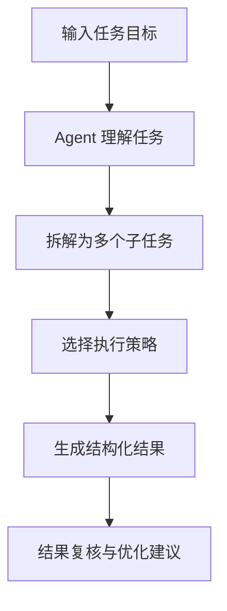

# AI Agent Workflow Assistant

一个用于展示 **AI Agent 自动化任务拆解、资料整理、代码辅助与文档生成** 的 GitHub 项目模板。该项目适合用于展示个人在 AI Agent / AI 工具链方面的实践成果，也可以作为 Xiaomi MiMo 100T 等 AI token 申请时的项目证明材料。

## 项目简介

AI Agent Workflow Assistant 是一个轻量级的 AI Agent 工作流示例项目。用户输入一个任务目标后，系统会模拟 Agent 的工作方式，将任务拆解为多个步骤，并生成结构化执行计划、结果摘要和后续建议。

项目重点展示以下能力：

- 任务理解与目标拆解
- 多步骤 Agent 工作流设计
- 文档总结与结构化输出
- 代码辅助与自动化脚本组织
- 可复用的 AI 应用项目结构

## 解决的痛点

在学习、开发和资料整理过程中，很多任务需要反复经历以下流程：

1. 理解需求
2. 拆解任务步骤
3. 搜集或整理资料
4. 生成代码、文档或方案
5. 检查结果并优化

如果全部依靠人工完成，效率较低且容易遗漏细节。本项目通过 Agent 工作流的方式，将复杂任务拆分成清晰步骤，帮助用户更快得到可执行结果。

## 核心工作流



## 项目结构

```text
ai-agent-workflow-assistant/
├── README.md
├── LICENSE
├── requirements.txt
├── .gitignore
├── examples/
│   └── sample_tasks.md
├── src/
│   ├── main.py
│   ├── agent.py
│   └── workflow.py
└── docs/
    ├── application_statement.md
    └── screenshots.md
```

## 快速开始

### 1. 克隆项目

```bash
git clone https://github.com/your-username/ai-agent-workflow-assistant.git
cd ai-agent-workflow-assistant
```

### 2. 安装依赖

```bash
pip install -r requirements.txt
```

### 3. 运行示例

```bash
python src/main.py
```

运行后可以输入一个任务，例如：

```text
帮我设计一个用于整理学习资料的 AI Agent 工作流
```

系统会输出任务拆解、执行步骤和结果建议。

## 示例输出

```text
任务目标：设计一个用于整理学习资料的 AI Agent 工作流

Agent 拆解结果：
1. 识别资料来源：网页、PDF、笔记、代码仓库
2. 提取核心内容：关键词、摘要、重要结论
3. 生成结构化笔记：标题、目录、要点、行动项
4. 输出复习计划：按优先级和时间安排复习任务
5. 进行结果复核：检查是否遗漏重要信息
```

## 可用于申请材料的说明

本项目可以作为 AI Agent 使用成果证明。建议在提交申请时补充以下材料：

- 项目运行截图
- 终端输出截图
- GitHub 项目链接
- README 页面截图
- AI 工具或 API 使用记录截图

## 后续计划

- 接入真实大模型 API
- 增加本地知识库检索能力
- 支持 PDF、Markdown、网页内容解析
- 增加多 Agent 协作示例
- 增加 Web UI 演示页面

## License

MIT License
